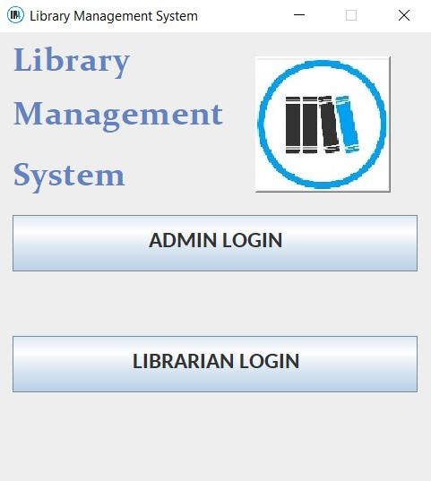
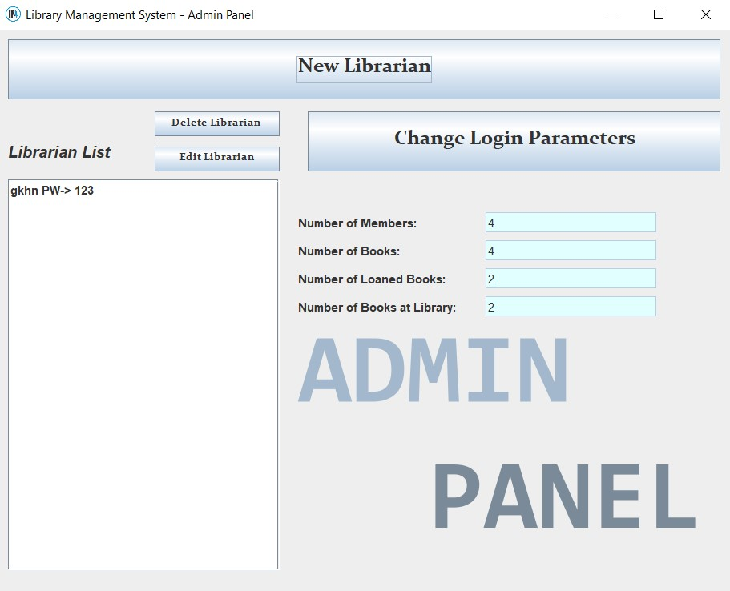
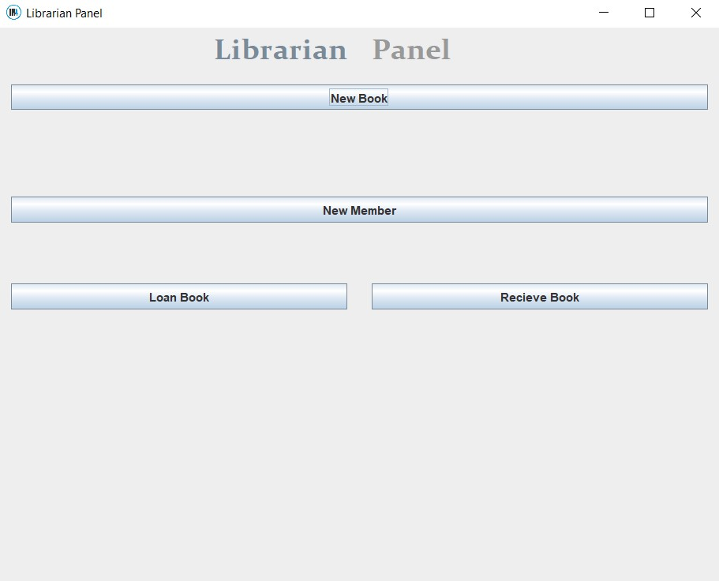
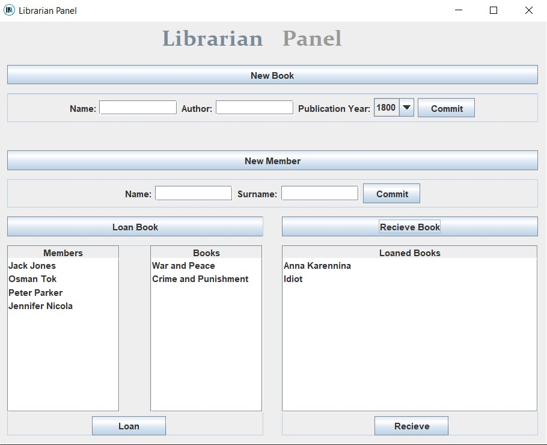

# library_management_system_java
A library management application with java codes.

# Main Frame
You can login as admin or librarian. For login as librarian, first create a librarian in Admin Panel.
Default Admin Login Info:
ID: admin
Password: admin

# Admin Panel
You can create and delete librarian. You can change login parameters. You can see book number at the library, member number of library, loaned books's number and all books registered the library.

# Librarian Panel
Librarian can add books and members, loan books to members and recieve books from them.

